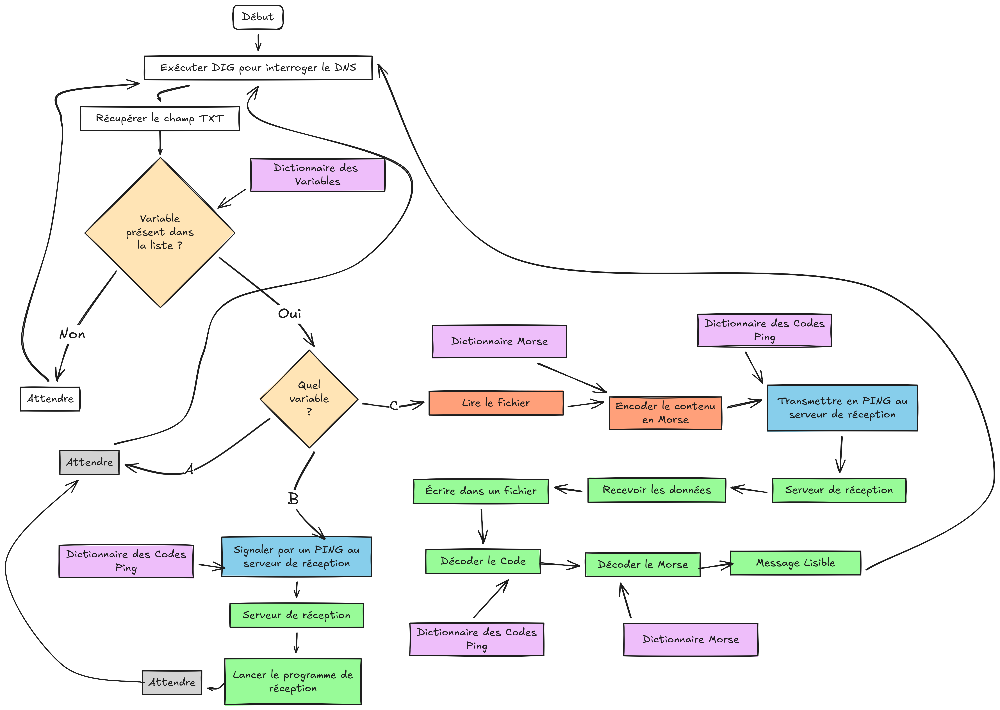

# 🔐 T-SEC-911 Virology

**Recherche et développement de techniques d'exfiltration de données et d'obfuscation**

---
## 📋 Description

* Afin de mieux comprendre les concepts et d’aider au développement du projet, ce document présente un diagramme de flux illustrant le fonctionnement du système d’exfiltration des données, depuis leur collecte sur une machine compromise jusqu’à leur exfiltration via des canaux discrets. Le système est également capable de recevoir des ordres à partir du contenu d’un enregistrement DNS.

## Diagramme de flux

Diagramme réaliser sur Excalidraw : https://excalidraw.com/

---

**T-SEC-911 Virology**

