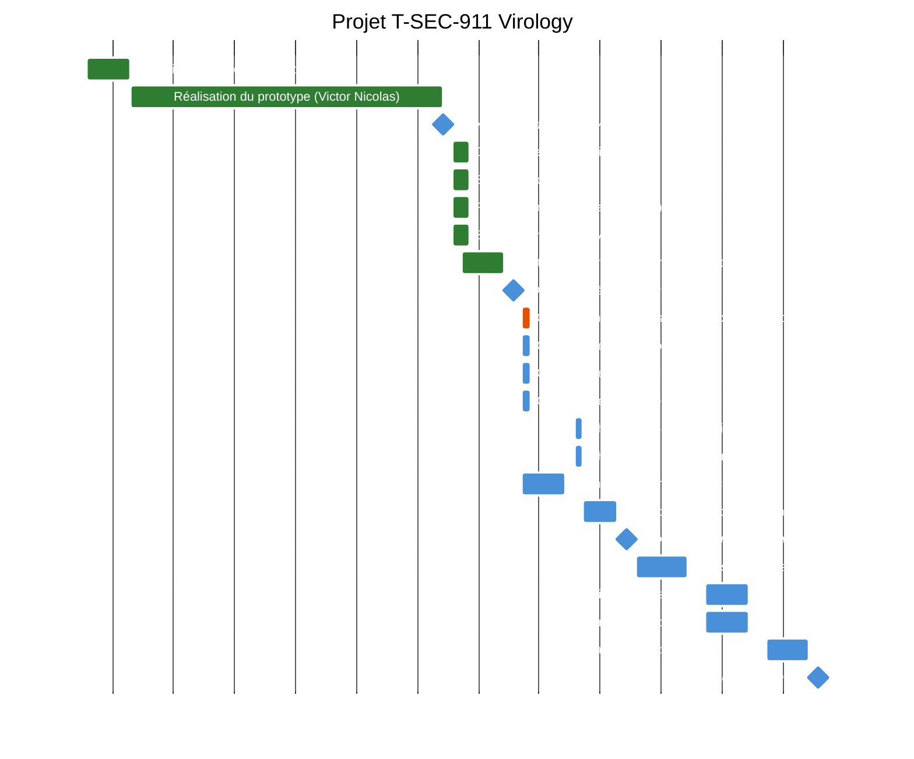

# 🔐 T-SEC-911 Virology

**Recherche et développement de techniques d'exfiltration de données et d'obfuscation**

---

## 📋 Gestion de projet

### Méthodologie Gantt
Nous utilisons un diagramme de Gantt pour planifier et suivre l'avancement des différentes tâches du projet T-SEC-911 Virology. Ce diagramme permet de visualiser les étapes clés, les dépendances entre les tâches, ainsi que les échéances importantes.

Cela nous permet de gérer efficacement le temps et les ressources, assurant ainsi que le projet progresse.

## Diagramme de Gantt

---

**T-SEC-911 Virology**

