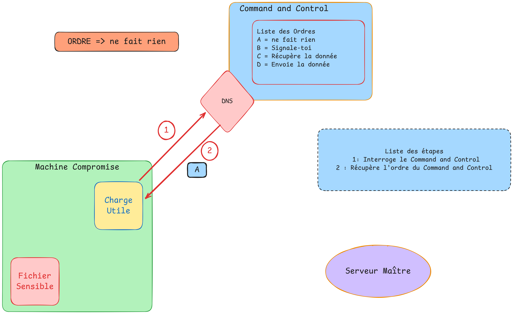
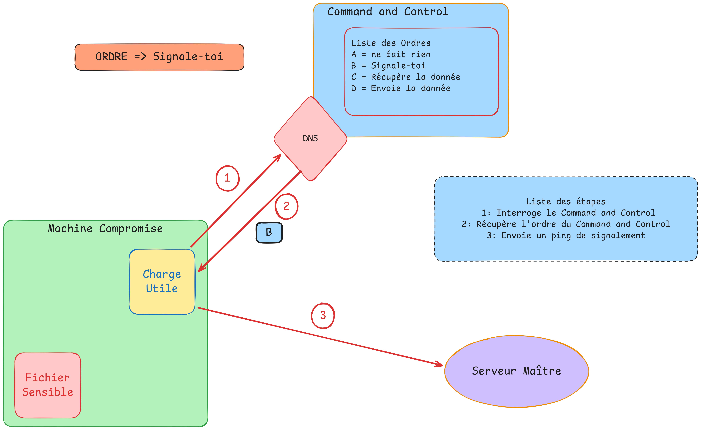
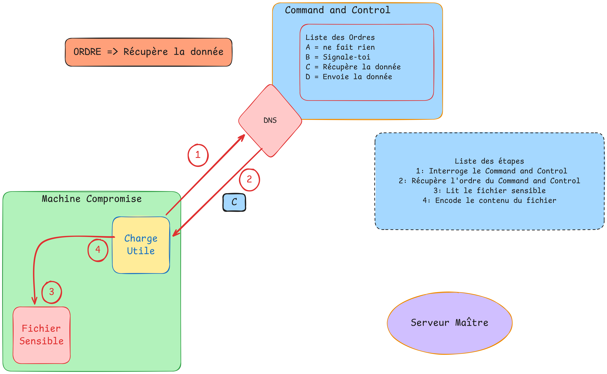
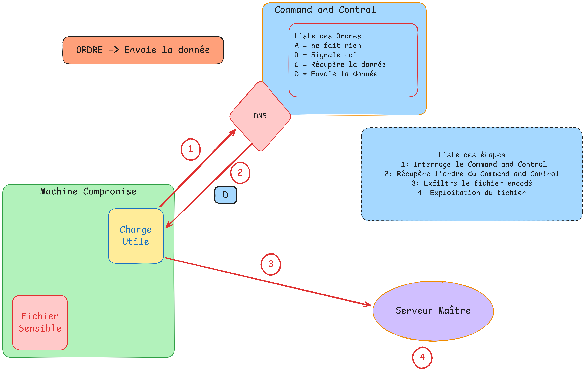

# 🔐 T-SEC-911 Virology

**Recherche et développement de techniques d'exfiltration de données et d'obfuscation**

---

## 📋 Description
* Le schéma fonctionnel du projet nous permet d'illustrer les différentes étapes du processus de fonctionnement de la charge utile.
 ---

### Étape 1 : Collecte du premier Ordre
* Le processus commence par la collecte du premier ordre à partir d'un enregistrement TXT présent dans la configuration du serveur DNS et ainsi récupérer les premières instructions.

Schéma réalisé sur Excalidraw : https://excalidraw.com/
---

### Étape 2 : Collecte du deuxième Ordre

* Une fois le premier ordre exécuté, la charge utile récupère le second, puis envoie une requête ping au serveur maître afin de l'informer qu'elle est opérationnelle et prête à traiter les tâches suivantes.

Schéma réalisé sur Excalidraw : https://excalidraw.com/
---
### Étape 3 : Collecte du troisième Ordre

* Dès la récupération du troisième ordre, la charge utile lit le contenu d'un fichier sensible et l'encode en code Morse.
  Schéma réalisé sur Excalidraw : https://excalidraw.com/
---

### Étape 4 : Collecte du quatrième Ordre

* Enfin, la charge utile récupère le dernier ordre et exfiltre les données encodées en code Morse au moyen de requêtes ping envoyées vers le serveur maître.
  Il ne reste alors plus qu'à décoder les données reçues afin de reconstituer le contenu du fichier sensible.

Schéma réalisé sur Excalidraw : https://excalidraw.com/

---

**T-SEC-911 Virology**

